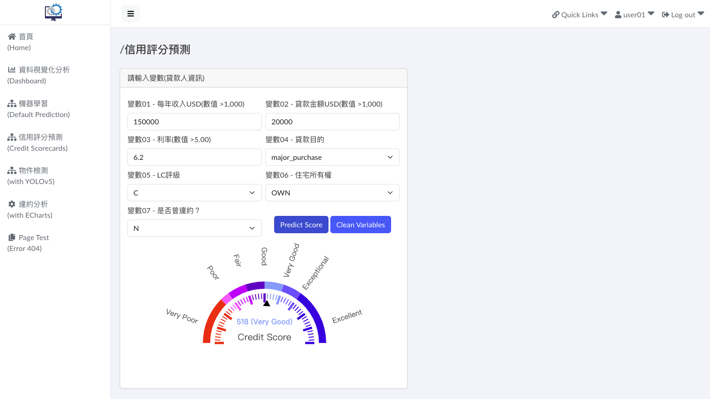

# **credit_scorecards_demo_01**

## **Demonstrating the implementation and development of Credit Scorecards**

#### **Ⅰ. 目的** 
網路上有許多高手提供Credit Scorecards專案，甚至開發為套件上傳到PyPI(Python Package Index)，如：scorecardpy、toad…等。於是站在巨人的肩膀上，引用其程式碼、簡化內容、使用不同資料集，來練習數據分析及機器學習之應用。 

#### **Ⅱ. 主要工具或套件**
Python、PostgreSQL、Scikit-learn

#### **Ⅲ. 說明**
1. 資料集 
發現較少有使用資料集Lending Club Loan Data來作Credit Scorecards，因此選擇此資料集。資料集約226萬筆，151個欄位。ETL(Extract-Transform-Load)作業後，資料集約225萬筆及26個欄位，為方便查詢或處理，將此資料集匯入PostgreSQL資料庫。 
2. 變數選擇 
參考網上專案常選用的變數，簡化模型僅選7個相似變數(欄位，如程式碼sql_str所示)。另外，Response Variable部份，將欄位loan_status內容 Fully Paid、Current、Grace視作「非違約」，其餘則為「違約」。違約佔全部資料超過10%，考量Imbalanced Data，故取20萬筆違約資料，加上20萬筆非違約，且排除缺失值部份共計40萬筆資料來訓練模型。 
3. 主要參考 
網路文章Logistic Regression in Building Credit Scorecard ([詳見](<https://medium.com/@rachmanto.rian/logistic-regression-in-building-credit-scorecard-924bece9f953>))，內容圖文並茂，該作品非常優秀。 
4. 結果 
本專案目的在於練習數據分析及機器學習之應用，故不考慮變數或模型績效指標衡量，亦不作探索性分析(Exploratory Data Analysis, EDA)。訓練模型程式為「get_train_model.py」、預測或推論程式為「get_inference.py」。 
另外，為了讓理論方法實際落地，並且有效運用，於另一專案( 詳見 [django_demo_01](<https://github.com/qinglian1105>) )。將模型及推論程式部署成為模型計算API，供前端網頁調用。部份頁面及說明如下：  

   ● 選單四 - 信用評分預測(Credit Scorecards)，填寫變數資料送出便開始調用模型API運算，預測結果(分數、評級)於下方以藍色文字及儀表盤呈現。 

    
    
  

---

#### **Ⅳ. References**

[1] [Lending Club Loan Data
](<https://www.kaggle.com/datasets/adarshsng/lending-club-loan-data-csv/data>)

[2] [Logistic Regression in Building Credit Scorecard](<https://medium.com/@rachmanto.rian/logistic-regression-in-building-credit-scorecard-924bece9f953>)

[3] [End-to-End Guide to Building a Credit Scorecard Using Machine Learning](<https://towardsdatascience.com/end-to-end-guide-to-building-a-credit-scorecard-using-machine-learning-6502d8bb765a>)

[4] [Credit Risk Dataset](<https://www.kaggle.com/datasets/laotse/credit-risk-dataset/code>)

[5] [ShichenXie/scorecardpy](<https://github.com/ShichenXie/scorecardpy>)

[6] [toad.scorecard module](<https://toad.readthedocs.io/en/stable/toad.scorecard.html>)