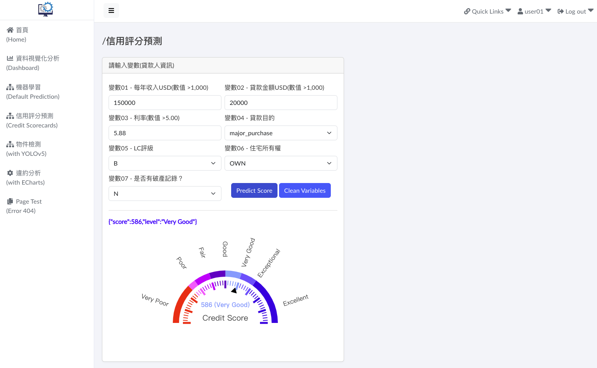

# **credit_scorecards_demo_01**

## **Developing Credit Scorecards - 建模及預測展示**

#### **Ⅰ. 目的** 
網路上有許多高手或大師提供Credit Scorecards開發專案，甚至有python package: scorecardpy、toad…等。於是站在巨人的肩膀上引用其程式碼、簡化內容、使用不同資料集，來練習數據分析及機器學習之應用。 

#### **Ⅱ. 說明**
1. 資料集： 
近期的研調發現很少有使用資料集Lending Club來作Credit Scorecards，因此選擇此資料集。Lending Club Loan Dataset約260萬筆，26個欄位。為方便查詢或處理，將此資料集匯入PosgreSQL資料庫。 
2. 變數選擇： 
依網上先進常選用的變數，本模型僅選7個相似變數(欄位)。另外，Response Variable部份，將欄位loan_status內容 Fully Paid、Current、Grace視作「非違約」，其餘則為「違約」。違約佔全部資料超過10%，考量Imbalanced Data，故取20萬筆違約資料，加上20萬筆非違約，且無缺失值共40萬筆資料來訓練模型。 
3. 主要參考： 
網路文章Logistic Regression in Building Credit Scorecard ([詳見](<https://medium.com/@rachmanto.rian/logistic-regression-in-building-credit-scorecard-924bece9f953>))，該作品非常優秀。 
4. 結果： 
目的在於練習數據分析及機器學習之應用，故不考慮變數或模型績效指標衡量，亦不作探索性分析(Exploratory Data Analysis, EDA)。訓練程式為get_train_model.py、預測程式為get_inference.py。讓理論方法實際落地，並且有效運用，於另一專案將模型及推論程式部署成為模型計算API，供前端網頁調用。部份頁面及說明如下：  
 

- 選單四 - 信用評分預測(Credit Scorecards)，填寫變數資料送出調用模型API運算，預測結果(分數、評級)以儀表盤呈現。專案全部內容 (django_demo_01 [詳見](<https://github.com/qinglian1105>))。

   

---
#### References

[1] [Lending Club Loan Data
](<https://www.kaggle.com/datasets/adarshsng/lending-club-loan-data-csv/data>)

[2] [Logistic Regression in Building Credit Scorecard](<https://medium.com/@rachmanto.rian/logistic-regression-in-building-credit-scorecard-924bece9f953>)

[3] [End-to-End Guide to Building a Credit Scorecard Using Machine Learning](<https://towardsdatascience.com/end-to-end-guide-to-building-a-credit-scorecard-using-machine-learning-6502d8bb765a>)

[4] [Credit Risk Dataset](<https://www.kaggle.com/datasets/laotse/credit-risk-dataset/code>)

[5] [ShichenXie/scorecardpy](<https://github.com/ShichenXie/scorecardpy>)

[6] [toad.scorecard module](<https://toad.readthedocs.io/en/stable/toad.scorecard.html>)